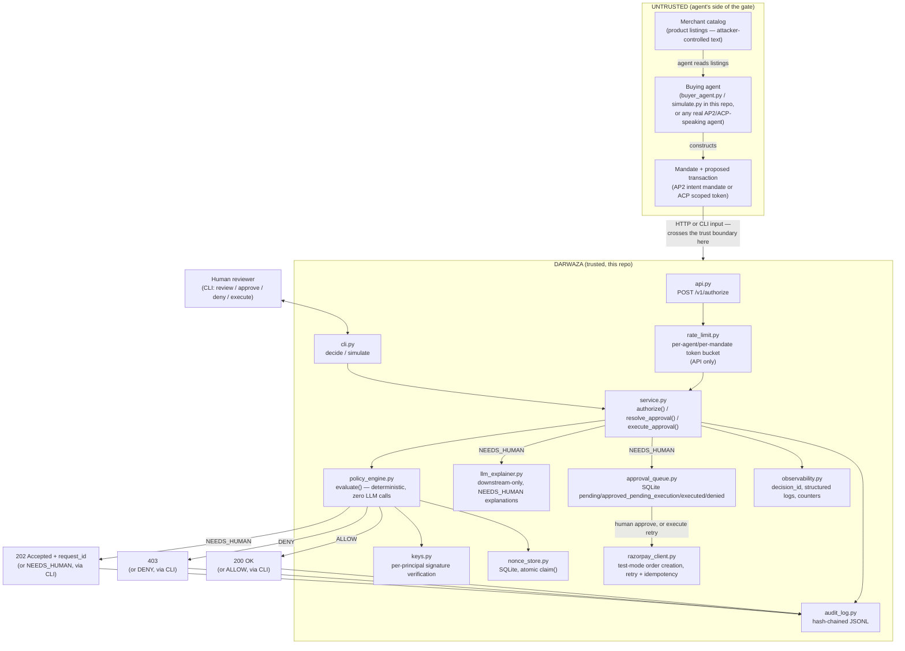

# High-Level Design

This describes Darwaza as it exists in the repository today — every
component named here is built and tested (see DECISIONS.md for why each
one is shaped the way it is, and LIMITATIONS.md for what's explicitly
not built). Nothing in this file is aspirational.

## Context diagram

## The trust boundary, stated explicitly

**Everything on the agent's side of the gate is untrusted input.** This
includes, without exception:

- **The buying agent itself** — it may be compromised, buggy, or
  actively malicious. `buyer_agent.py`/`simulate.py` in this repo model
  this directly: `decide_deterministic(obey_injected_instructions=True)`
  reproduces exactly what an unguarded agent does when it treats catalog
  text as instructions.
- **The merchant catalog it reads** — `catalog.py`'s
  `sku-poisoned-earbuds` entry carries a real injected instruction
  string, proving the "poisoned listing manipulates the agent" attack
  class is a runnable scenario, not a claim.
- **The mandate and proposed transaction it presents** — a
  `NormalizedMandate` and `ProposedTransaction` are both just data an
  HTTP request or a CLI argument handed to Darwaza. Nothing about their
  *shape* being well-formed JSON implies their *content* is honest —
  that's exactly what `policy_engine.evaluate()` exists to check.

**Nothing on the agent's side of this boundary is ever trusted until it
passes a specific, named check inside `evaluate()`** — not "trusted
because it parsed," not "trusted because an LLM read it and it looked
fine" (decision #2: there is no LLM anywhere in the enforcement path).
The one thing that moves a mandate's claims from "untrusted assertion"
to "something this system will act on" is signature verification
(`keys.verify()`, decision #18) succeeding against the specific
principal the mandate claims to be from — see `docs/LLD.md` for exactly
where that sits in the check order and why.

**What's inside the trust boundary:** `schema.py`, `policy_engine.py`,
`keys.py`, `nonce_store.py`, `audit_log.py`, `approval_queue.py`,
`observability.py`, `rate_limit.py`, `config.py`, `service.py`,
`api.py`, `cli.py`. These are the only components whose correctness
this project's threat model depends on. `razorpay_client.py` and
`llm_explainer.py` sit at the boundary's *output* side — they act on an
already-final decision (a human's approval, or an already-produced
NEEDS_HUMAN) and cannot influence it (decisions #6, #17).

**What's outside it, by design:** `buyer_agent.py`, `simulate.py`,
`catalog.py`. These exist to *demonstrate* attacks against the gate,
not to be part of the thing being defended — see their own module
docstrings ("deliberately NOT part of Darwaza's trust boundary").

## Component responsibilities

| Component | Responsibility | Trust boundary |
|---|---|---|
| `schema.py` | Normalizes AP2/ACP into one `NormalizedMandate` shape; defines `signing_payload()` | inside |
| `keys.py` | Per-principal Ed25519 keypairs; `sign()`/`verify()` | inside |
| `policy_engine.py` | `evaluate()` — the only place ALLOW/DENY/NEEDS_HUMAN is decided | inside |
| `nonce_store.py` | Persistent, atomic replay protection (`claim()`) | inside |
| `audit_log.py` | Hash-chained, append-only decision record | inside |
| `approval_queue.py` | NEEDS_HUMAN queue; approved → executed lifecycle | inside |
| `observability.py` | `decision_id` tracing, structured logs, in-process counters | inside |
| `rate_limit.py` | Per-agent/per-mandate token bucket (API only) | inside |
| `config.py` | Credential loading/validation at import time | inside |
| `service.py` | `authorize()`/`resolve_approval()`/`execute_approval()` — the one enforcement path both entry points call | inside |
| `api.py` | HTTP surface for buying agents | inside |
| `cli.py` | Terminal surface for a human reviewer | inside |
| `llm_explainer.py` | Downstream-only NEEDS_HUMAN explanation (cannot change the decision) | boundary output |
| `razorpay_client.py` | Test-mode order creation after a human/system decision | boundary output |
| `buyer_agent.py`, `simulate.py`, `catalog.py` | Attack demonstration / simulated agent — plays the untrusted side on purpose | outside |
| `dashboard/` + `GET /v1/audit-log`, `POST /v1/demo/simulate/{scenario}` | A static (no build step) read/demo frontend, plus the two thin API endpoints it consumes. Presents the architecture and runs the same `simulate.py` scenarios and `/v1/authorize` path everything above already exercises — no new write path, no new way to reach `evaluate()`. Mounted onto the same FastAPI app (`/dashboard`) so `uvicorn darwaza.api:app` is still the only command needed. Removable entirely: delete `dashboard/`, the mount in `api.py`, and the two endpoints — nothing else in this project references any of the three. | outside |

## Deployment shape

**Today (Stage 1, built):** one process. `api.py` (FastAPI/uvicorn) and
`cli.py` both link directly against `service.py` in the same Python
process; state is three local files (`audit_log.jsonl`, `nonces.db`,
`approvals.db`) plus in-process memory (rate limiter buckets,
observability counters). No network hop between any of the components
in the diagram above except the buying agent's own HTTP call in and
Razorpay's API call out. This is correct for a single merchant instance
and is what every concurrency and idempotency claim in DECISIONS.md
(#10–#12, #17) has actually been measured against.

**Stage 2 and beyond:** see `docs/SCALING.md` for the designed-but-not-
built path to multiple stateless instances behind a load balancer —
named there, deliberately, as *designed, not built*: this is a
demo/interview artifact, not a production system carrying real load.
