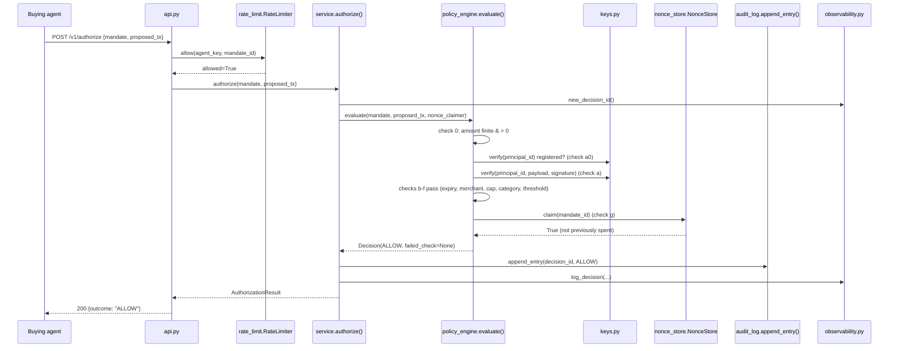
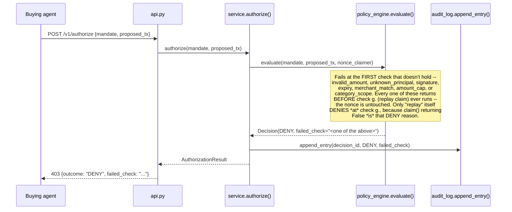
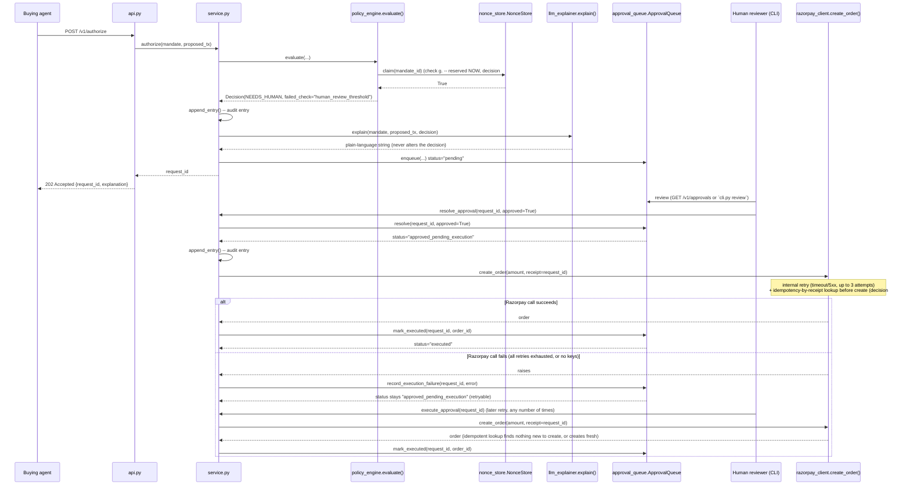
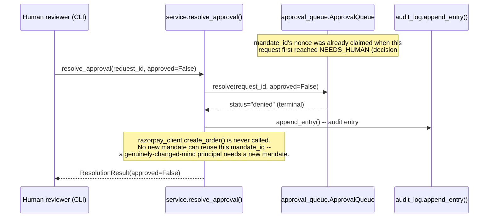

# Low-Level Design

Sequence diagrams, the full check order inside `policy_engine.evaluate()`
and why that order is load-bearing, the actual data model, and the
`failed_check` taxonomy. Everything here matches the code as it exists
today (see `git log` / DECISIONS.md for how it got this way).

## Sequence diagrams

### ALLOW path



### DENY path



### NEEDS_HUMAN → approve → execute path



### NEEDS_HUMAN → deny path



## The check order inside `evaluate()`, and why it's load-bearing

```
0.  Amount validity        -- math.isfinite(amount) and amount > 0
a0. Unknown principal      -- principal_id in keys.PUBLIC_KEYS
a.  Signature               -- keys.verify(principal_id, payload, signature)
b.  Expiry                  -- mandate.expiry > now
c.  Merchant match          -- ACP-only: mandate.merchant_id == proposed_tx.merchant_id
d.  Amount cap               -- ACP: exact match. AP2: proposed_tx.amount <= max_amount
e.  Category scope           -- AP2-only: proposed_tx.category in category_scope
f.  Human review threshold  -- AP2-only: amount > 0.5 * max_amount -> NEEDS_HUMAN (not DENY)
g.  Replay/claim            -- nonce_claimer.claim(mandate_id), LAST
```

`evaluate()` returns at the **first** check that fails — this is not
incidental, it's what makes the check order itself a correctness
property, not just a style choice:

- **0 and a0/a run before everything else.** Every check from b. onward
  reads a *field of the mandate* (`expiry`, `merchant_id`, `max_amount`,
  `category_scope`) — and until check a. has confirmed the mandate was
  actually signed by the principal it claims to be from, **every one of
  those fields is attacker-controlled**. Reading `mandate.max_amount`
  to decide anything before the signature is verified would mean an
  attacker could raise their own cap simply by editing the JSON, with
  no cryptography required to make the gate believe it. Check a0 (an
  unregistered principal, decision #18) sits immediately before check
  a. rather than after it, because an unregistered principal has no key
  to check the signature against *at all* — there's nothing for check
  a. to even attempt in that case. Check 0 (amount validity) is the one
  exception allowed to run first: `proposed_tx` was never signed by
  anyone (it's the agent's live claim about what it wants to buy right
  now, not part of what the principal authorized), so confirming its
  shape is sane doesn't require trusting the mandate at all — see
  DECISIONS.md #8.
- **g. (replay/claim) runs LAST, deliberately, and is fused into one
  atomic operation with the check itself (decision #10).** If the nonce
  claim ran earlier (its original position, third), a mandate that was
  always going to fail on, say, `amount_cap` would still burn its nonce
  on the way to that DENY. That turns replay protection into a
  denial-of-service primitive: an attacker who cannot forge a signature
  can still replay someone else's *legitimate* `mandate_id` attached to
  a deliberately out-of-policy `proposed_tx`, purely to exhaust the real
  principal's one legitimate use before they get to it. Running every
  other check first, and claiming only once the mandate is already
  known to end in ALLOW or NEEDS_HUMAN, closes that: a mandate can only
  ever be consumed by its own legitimate use.

Rate limiting (`rate_limit.py`, HTTP 429) is deliberately **not** a
check inside `evaluate()` at all — it runs in `api.py`, ahead of
`service.authorize()`, and never touches the nonce store, audit log, or
`Decision`/`Outcome` (decision #16). A 429 is "this request wasn't
evaluated yet," not a ninth policy check with an opinion about the
mandate's content.

## Data model

The actual Pydantic schemas (`schema.py`), unmodified:

```python
class ProposedTransaction(BaseModel):
    merchant_id: str
    amount: float = Field(gt=0, allow_inf_nan=False)
    category: str | None = None


class Outcome(str, Enum):
    ALLOW = "ALLOW"
    DENY = "DENY"
    NEEDS_HUMAN = "NEEDS_HUMAN"


class Decision(BaseModel):
    outcome: Outcome
    reason: str
    failed_check: str | None = None


class NormalizedMandate(BaseModel):
    # Present on both AP2 and ACP shapes
    mandate_id: str          # AP2: nonce/jti. ACP: single-use token id.
    principal_id: str
    expiry: datetime
    signature: str

    # AP2-only -- standing intent, not a bound transaction
    agent_id: str | None = None
    max_amount: float | None = None
    category_scope: list[str] | None = None

    # ACP-only -- exact, merchant-bound, single-use permission
    merchant_id: str | None = None
    exact_amount: float | None = None

    def signing_payload(self) -> bytes:
        """Every field except `signature`, canonical JSON (sorted
        keys, fixed separators) -- what a signature is computed over
        and verified against."""
```

The AP2/ACP asymmetry is real, not sloppy modeling (decision #1): an
AP2 mandate has `max_amount`/`category_scope`/`agent_id` and no
`merchant_id`/`exact_amount`; an ACP token is the reverse. `evaluate()`
branches on which fields are populated (`mandate.exact_amount is not
None` vs. `mandate.max_amount is not None`), not on an explicit
`protocol` discriminator field — there isn't one, by design, because
the normalized shape is supposed to make the two protocols
indistinguishable to every check except the ones that structurally
must differ (check c., d., e., f.).

## `failed_check` taxonomy

| `failed_check` value | Outcome | Meaning | Check |
|---|---|---|---|
| `invalid_amount` | DENY | `proposed_tx.amount` isn't a positive finite number (zero, negative, NaN, ±infinity) | 0 |
| `unknown_principal` | DENY | `principal_id` has no entry in `keys.PUBLIC_KEYS` — nothing to check the signature against at all | a0 |
| `signature` | DENY | Registered principal, but the signature doesn't verify against their key (forged, corrupted, or a field was tampered post-signing) | a |
| `expiry` | DENY | `mandate.expiry` is in the past | b |
| `merchant_match` | DENY | ACP token's bound `merchant_id` doesn't match `proposed_tx.merchant_id` | c |
| `amount_cap` | DENY | AP2: amount exceeds `max_amount`. ACP: amount doesn't exactly equal `exact_amount` | d |
| `category_scope` | DENY | AP2 mandate's `category_scope` doesn't include `proposed_tx.category` | e |
| `human_review_threshold` | **NEEDS_HUMAN** | AP2 amount exceeds 50% of `max_amount` — a correct, non-error outcome, not a failure | f |
| `replay` | DENY | `mandate_id` was already claimed by an earlier request | g |
| `human_review_denied` | DENY | Not from `evaluate()` — set by `service.resolve_approval()` when a human denies a NEEDS_HUMAN request (the mandate's *second* audit entry) | n/a (post-`evaluate()`) |
| `None` | ALLOW | Every check passed | — |

Not a `failed_check` value at all, listed here because it's easy to
mistake for one: a **429 rate-limit response** carries no
`failed_check` — it's an HTTP-layer response from `rate_limit.py`,
produced before `evaluate()` ever runs, and `Decision`/`Outcome` has no
representation for it on purpose (decision #16).
